# Report

> Luca Parolari - 1236601 - luca.parolari@studenti.unipd.it \
> Bioinformatics \
> Department of Mathematics and Computer Science \
> University of Padua

The main goal of this document is to show how to implement a simple
analysis pipeline to detect structural variations on a reference
genome by aligning unknown bacterium reads.

The reference genome is from a bacterium called _Lactobacillus casei_
which is _3079196 bp_ long.

# Indice

- [Analysis](#analysis)
- [Implementation Details](#implementation-details)
  - [1. Sequence Coverage](#1-sequence-coverage)
  - [2. Physical Coverage](#2-physical-coverage)
  - [3. Single Mates](#3-single-mates)
  - [4. Average Fragments Length](#4-average-fragments-length)
  - [5. Relative Reads Orientation](#5-relative-reads-orientation)
  - [E1/E2. Average Fragments Length Distribution](#e1-e2-average-fragments-length-distribution)
  - [E3. Multiple Alignments](#e3-multiple-alignments)
  - [E4. Hard/Soft Clipping](#e4-hard-soft-clipping)
  - [Utils](#utils)
  - [Makefile](#makefile)
- [Reference](#reference)

# Analysis

Generated tracks help us to study the alignment of the donor genome on
the reference genome and detect structural variations.

For example, tracks with coverage and fragments length help us to
detect mainly insertion and deletions, and partially inversions. When
average fragments length increases usually we are facing a deletion,
otherwise it may be an inversion. The two tracks with probabilities of
insertion and deletion help us in this process.

However, inversions are hard to discover without extra information.
For this reason we added a track with orientations and hard/soft
clippings count.

To detect repeats we also added a track that counts multiple
alignments of reads: we want to identify anomalies as repeats as we
are interested only in "real" structural variations.

The following table is a collection of some anomalies found using IGV.

| ~ pos   | anomaly   | image                                          |
| ------- | --------- | ---------------------------------------------- |
| 147 kb  | repeat    | [0147_repeat.png](./img/0147_repeat.png)       |
| 620 kb  | deletion  | [0620_deletion.png](./img/0620_deletion.png)   |
| 700 kb  | inversion | [0700_inversion.png](./img/0700_inversion.png) |
| 900 kb  | deletion  | [0900_deletion.png](./img/0900_deletion.png)   |
| 950 kb  | repeat    | [0950_repeat.png](./img/0950_repeat.png)       |
| 1392 kb | deletion  | [1392_deletion.png](./img/1392_deletion.png)   |
| 2086 kb | insertion | [2086_insertion.png](./img/2086_insertion.png) |

This is the alignment on the genomic browser at the first glance.

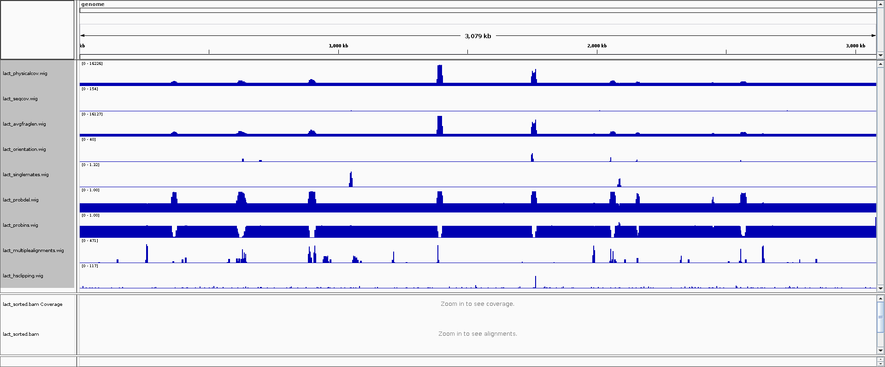

Here follows some examples of anomalies.

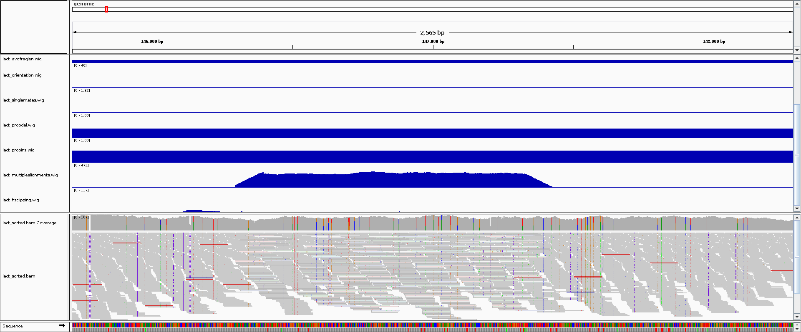

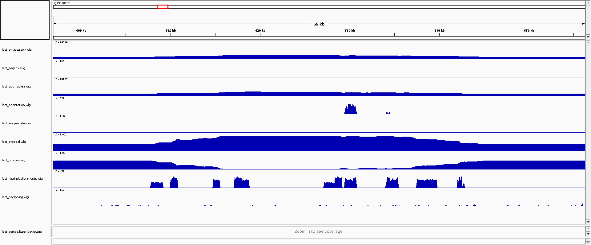

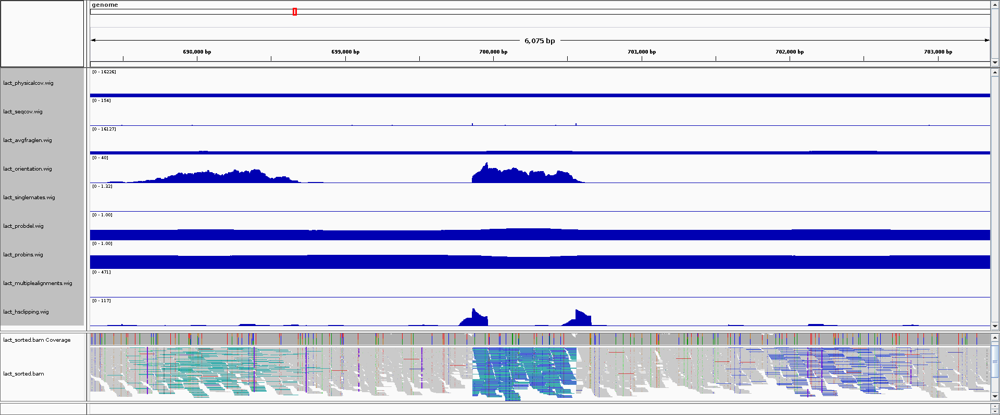

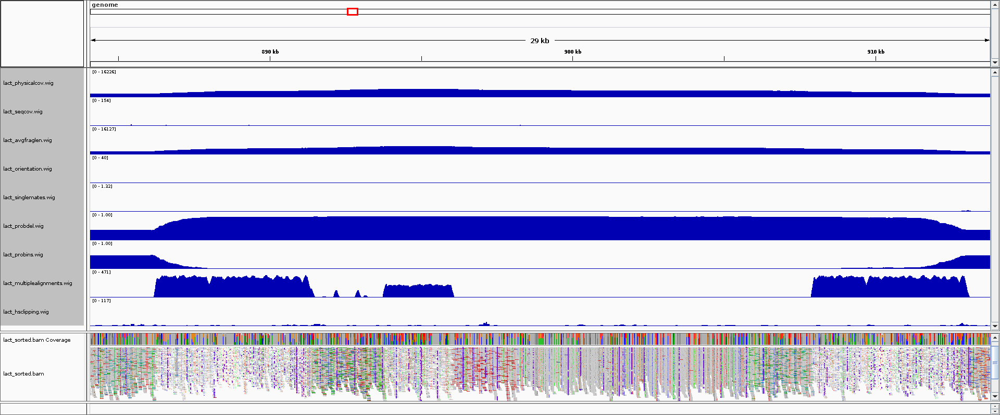

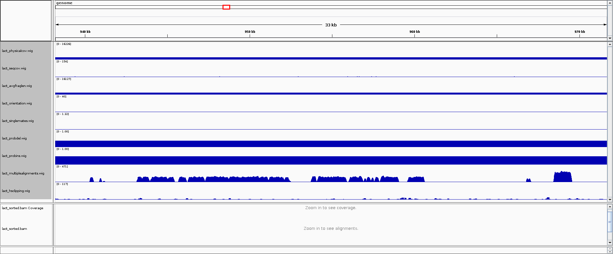

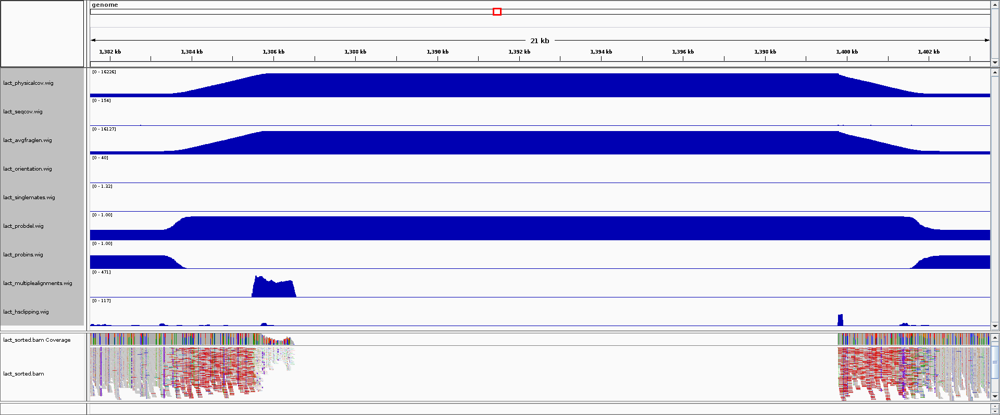

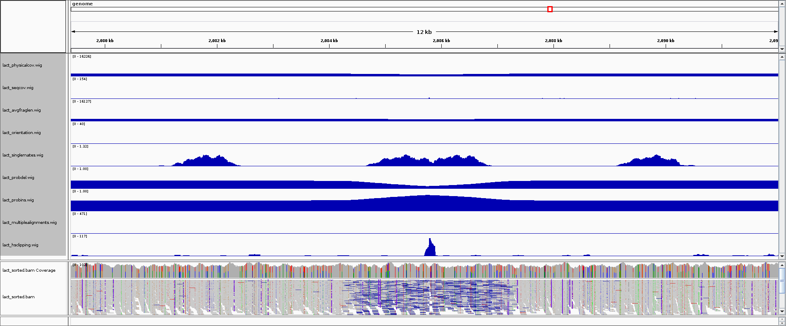

# Implementation Details

Please note that code snippes reported here omit tons of details. For
a full comprehension of the program one should read the source code
which, we belive, is readable, documented and self-contained.

Note also that programs are not very fast: they take up a lot of
memory by preallocating all the data structures and keeping in memory
the whole sam file. Obviuously, this is a very bad drowback in case of
professional software but in this case we preferred to keep the code
readable as it is done only for academic purposes.

## 1. Sequence Coverage

Sequence coverage is a number that, for every genomic position, counts
number of reads mapping there. The count is done only for the read.

More precisely, sequence coverage is the average number of reads that
align to, or "cover", known reference bases.

The sequencing coverage level often determines whether variant
discovery can be made with a certain degree of confidence at
particular base positions, in fact, higher levels of coverage means
each base is covered by a greater number of aligned sequence read.

> See [`sequence_coverage.py`](../sequence_coverage.py) for more
> details. (Given source code).

## 2. Physical Coverage

Physical coverage is a number that, for every genomic position, counts
number of fragments mapping there. The main difference between
sequence coverage and physical coverage is that in the first the count
is done on reads while the second is done on fragments.

Physical coverage in implemented in module `physical_coverage`. The
main function in this module is `get_physical_coverage_percentage`
which relies on `get_physical_change` and `get_sum_fragment_change` to
collect physical change and sum fragment change. Functions are listed
below.

This two "changes" work as input for the main algorithm that produces
the track by dividing the physical change by sum fragment change.

```python
def get_physical_coverage_percentage(mates, genome_length):
    """
    Return an array with physical coverage percentage for every
    genomic position.

    Parameters
    ----------
    * mates: A list of plausible mates.
    * genome_length: Length of genome.
    """
    genome_physical_coverage = []

    genome_physical_change = get_physical_change(mates, genome_length)
    genome_sum_fragment_change = get_sum_fragment_change(mates, genome_length)

    current_physical_coverage = 0
    current_sum_fragment_length = 0

    for i in range(genome_length):
        current_physical_coverage += genome_physical_change[i]
        current_sum_fragment_length += genome_sum_fragment_change[i]

        if(current_physical_coverage > 0):
            coverage = current_sum_fragment_length / current_physical_coverage
        else:
            coverage = 0

        genome_physical_coverage.append(coverage)

    return genome_physical_coverage
```

```python
def get_physical_change(mates, genome_length):
    """
    Return an array where every genomic position represents the
    number of mates starting at that genomic position.
    """
    genome_physical_change = [0] * genome_length

    for mate in mates:
        pos = mate["pos"]
        pnext = mate["pnext"]

        if is_first_and_second_read_mapped(mate):

            first_mate_starting_position = pos
            second_mate_finish_position = pnext + MATE_LENGTH

            genome_physical_change[first_mate_starting_position] += 1
            genome_physical_change[second_mate_finish_position] -= 1

    return genome_physical_change
```

```python
def get_sum_fragment_change(mates, genome_length):
    """
    Return an array where every genomic position represents the sum
    of the length of fragments with the first mate starting at that
    genomic position.
    """
    genome_sum_fragment_change = [0] * genome_length

    for mate in mates:
        pos = mate["pos"]
        pnext = mate["pnext"]

        if is_first_and_second_read_mapped(mate):

            first_mate_starting_position = pos
            second_mate_finish_position = pnext + MATE_LENGTH

            fragment_length = second_mate_finish_position - first_mate_starting_position

            genome_sum_fragment_change[first_mate_starting_position] += fragment_length
            genome_sum_fragment_change[second_mate_finish_position] -= fragment_length

    return genome_sum_fragment_change
```

> See [`physical_coverage.py`](../physical_coverage.py) for more
> details.

## 3. Single Mates

Single mates are mate pairs where only one of the two reads maps on
the genome.

Single mates count is implemented in `single_mates` module. The main
point of the wholo module is in the function
`get_single_mates_percentage` that highly relies on
`get_single_mates`, listed below.

```python
def get_single_mates_percentage(mates, genome_length):
    """
    Returns single mates percentage by computing the sum of single mates on each
    genomic position, dividing by single mates count and multiplying by 100.
    """

    single_mates_percentage = []

    single_mates = get_single_mates(mates, genome_length)
    single_mates_count = get_single_mates_count(mates)

    logging.info(f"single_mates_count = {single_mates_count}")

    current_single_mates = 0

    for i in range(genome_length):
        current_single_mates += single_mates[i]
        single_mates_percentage.append(current_single_mates * 100 / single_mates_count)

    return single_mates_percentage
```

```python
def get_single_mates(mates, genome_length):
    """
    Returns an array with
    *  1, at the start of one unmapped mate
    * -1, at the end of one unmapped mate
    *  0, elsewhere
    """

    # Get average and standard deviation for distance mate pairs
    tlen_avg, tlen_std = get_tlen_distribution_params(mates)

    logging.info(f"tlen_avg = {tlen_avg}")
    logging.info(f"tlen_avg = {tlen_std}")

    # Initialize array for storing all single mate pairs percentage
    single_mates = [0] * genome_length

    for mate in mates:
        pos = mate["pos"]

        if is_first_read_exlusively_mapped(mate):
            # First mate maps, while the second does not
            mapped_mate = pos
            unmapped_mate = mapped_mate + int(tlen_avg)

            single_mates[unmapped_mate] += 1
            single_mates[unmapped_mate + MATE_LENGTH] -= 1

        if is_second_read_exlusively_mapped(mate):
            # First mate does not map, while the second does
            mapped_mate = pos
            unmapped_mate = mapped_mate - int(tlen_avg)

            single_mates[unmapped_mate] += 1
            single_mates[unmapped_mate + MATE_LENGTH] -= 1

    return single_mates
```

> See [`single_mates.py`](../single_mates.py) for more details.

## 4. Average Fragments Length

Average fragment length is a number that, for every genomic position,
represents the average coverage of fragments on that position.

We compute the average fragments length with the usual sum of changes
on physical genome. Average fragments length needs two values to be
calculated is implemented in module `mean_fragments_length` by the
function `get_avg_fragments_length` listed below.

```python
def get_avg_fragments_length(mates, genome_length):
    """
    Return an array where every genomic position represents the average
    length of fragments at that position.
    """
    avg_fragments_length = [0] * genome_length

    physical_coverage = get_physical_coverage(mates, genome_length)
    fragments_length = get_framents_length(mates, genome_length)

    current_phisical_coverage = 0
    current_fragments_length = 0

    for i in range(genome_length):
        current_phisical_coverage += physical_coverage[i]
        current_fragments_length += fragments_length[i]

        if (current_phisical_coverage == 0):
            avg_fragments_length[i] = 0
            continue

        result = current_fragments_length / current_phisical_coverage
        avg_fragments_length[i] = int(result)

    return avg_fragments_length
```

This function uses `get_physical_coverage` and `get_framents_length`
in order to compute the average fragments length. As in the other
program the final track is obtained dividing the fragments length
change by physical coverage change for every genomic position.

> See [`mean_fragments_length.py`](../mean_fragments_length.py) for
> more details.

## 5. Relative Reads Orientation

We calculated realtive reads orienation as a metric that, for every
genomic position, counts whether a read is mapping in FR mode.

In fact, with "standard" sequencing technologies like Illumina, reads
should align only in FR mode. Other mapping types (i.e., FF, RR or RF)
means reads are probably wrong.

The two main functions in this module are `XX` and `YY`, listed below.

```python
def get_relative_orientations(mates, genome_length):
    relative_orientations = [0] * genome_length

    changes = get_relative_orientations_change(mates, genome_length)
    current_change = 0

    for i in range(genome_length):
        current_change += changes[i]
        relative_orientations[i] = current_change

    return relative_orientations
```

```python
def get_relative_orientations_change(mates, genome_length):
    relative_orientations = [0] * genome_length

    # With standard sequencing technologies reads should align
    # in FR mode, if they align FF, RR or RF thay are probably
    # wrong.

    mates = list(filter(is_mapping_fr, mates))

    for mate in mates:
        pos = mate["pos"]
        pnext = mate["pos"]

        relative_orientations[pos] += 1
        relative_orientations[pnext + MATE_LENGTH] -= 1

    return relative_orientations
```

> See
> [`relative_orientation_reads.py`](../relative_orientation_reads.py)
> for more details.

## E1/E2. Average Fragments Length Distribution

In order to discard implausible segnment we should see how they are
distributed among the genome. In we calculate the distribution of
fragments length we end up with a pdf very close to a normal
distribution.

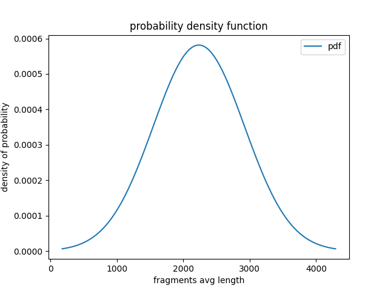

Using this pdf we can calculate the probability to be insertion and
deletions only by looking at the average fragments length: if a
fragment mapped on the rederence genome is short than the mean, we are
in front of an insertion on donor genome. We can identify deletions as
the simmetric case of inversions.

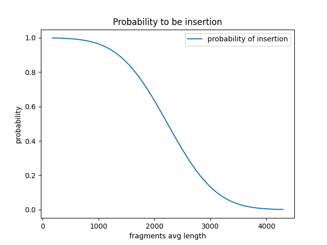

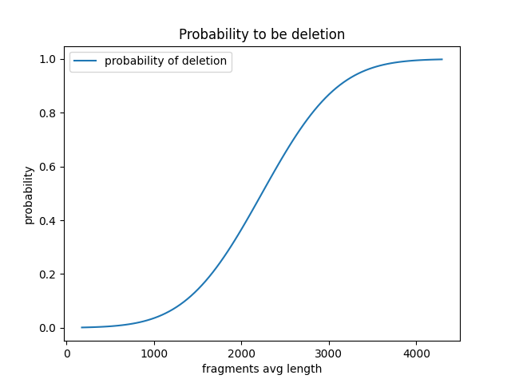

This program can generate charts for average fragments length
distribution, probability of insertion and probability of deletion
with option `--plot`.

With option `--track insertion` and `--track deletion` it generates
respectively the track for insertion and deletions probability.

This module implements three main functions: `get_pdf`,
`get_probability_for_insertion` and `get_probability_for_deletion`.
Those are used to retrieve probability by the distribution function
identified by `mu` (mean) and `std` (standard deviation).

```python
def get_pdf(x, mu, std):
    """
    Return the `y` for pdf with mean `mu` and standard deviation `std`
    for values on `x`.
    """
    return stats.norm.pdf(x, mu, std)
```

```python
def get_probability_for_insertion(x, mu, std):
    """
    Return the probability of `x` to be an insertion based on the pdf
    obtained by `mu` and `std`. Probability of insertion is higher if
    average fragments length is less than `mu`.

    Please note that `x` can be an array.
    """
    # stats.norm.sf is the survival function

    return stats.norm.sf(x, mu, std)
```

```python
def get_probability_for_deletion(x, mu, std):
    """
    Return the probability of `x` to be a deletion based on the pdf
    obtained by `mu` and `std`. Probability of deletion is higher if
    average fragments length is more than `mu`.

    Please note that `x` can be an array.
    """
    # stats.norm.cdf is the cumulative distrib function
    return stats.norm.cdf(x, mu, std)
```

> See
> [`fragments_length_distribution.py`](../fragments_length_distribution.py)
> for more details.

## E3. Multiple Alignments

Sometimes some reads can align multiple times on the genome. This can
help us to indentify repeats on the genome.

This program uses the sam field identified with _XA_ in order keep
track of extra alignment.

The module decodes the field by splitting it by `;` and then by `,` in
order to access to the _pos_ field of extra alignments and the sum _1_
to the genomic position where read maps.

Here follows the main functions for this module:
`get_multiple_alignments` and `get_multiple_alignments_change`.

```python
def get_multiple_alignments(mates, genome_length):
	multiple_alignments = [0] * genome_length
	multiple_alignments_change = get_multiple_alignments_change(mates, genome_length)

	current_change = 0

	for i in range(genome_length):
		current_change += multiple_alignments_change[i]
		multiple_alignments[i] = current_change

	return multiple_alignments
```

```python
def get_multiple_alignments_change(mates, genome_length):
	multiple_alignments_change = [0] * genome_length

	for mate in mates:
		pos = mate["pos"]
		aligments = mate["ma"]  # other alignments where read maps, can also be empty!

		if (len(aligments) == 0):
			continue

		# Mark this read as mutiple alignment
		multiple_alignments_change[pos] += 1
		multiple_alignments_change[pos + MATE_LENGTH] -= 1

		# Mark each read identified by current as multiple
		for aligment in aligments:
			# We need to "abs" bacause of + or - preceding aligment position
			aligment_pos = abs(int(aligment[1]))

			multiple_alignments_change[aligment_pos] += 1
			multiple_alignments_change[aligment_pos + MATE_LENGTH] -= 1

	return multiple_alignments_change
```

> See [`multiple_alignments.py`](../multiple_alignments.py) for more
> details.

## E4. Hard/Soft Clipping

Sometimes the genome has clippings on the alignment when part of
sequences are uncovered. This can help identify inversions, which is
usually a good structural variation to find.

The program uses CIGAR field in which we can find number of hard/soft
clippings. It computes hard/soft clippings track by counting number of
reads (with the +1 change method on genome) containing `H` or `S` in
CIGAR field.

This module implements two main functions: `get_hard_soft_clippings`
and `get_hard_soft_clippings_change`.

```python
def get_hard_soft_clippings(mates, genome_length):
	hard_soft_clippings = [0] * genome_length
	hard_soft_clippings_change = get_hard_soft_clippings_change(mates, genome_length)

	current_change = 0

	for i in range(genome_length):
		current_change += hard_soft_clippings_change[i]
		hard_soft_clippings[i] = current_change

	return hard_soft_clippings
```

```python
def get_hard_soft_clippings_change(mates, genome_length):
	hard_soft_clippings_change = [0] * genome_length

	is_read_mapped = lambda mate: (mate["flag"] & FLAG_SEGMENT_UNMAPPED) == FLAG_UNSET
	is_hard_clipping = lambda mate: "H" in mate["cigar"]
	is_soft_clipping = lambda mate: "S" in mate["cigar"]
	is_hard_or_soft_clipping = lambda mate: is_hard_clipping(mate) or is_soft_clipping(mate)

	mates = list(filter(is_read_mapped, mates))  # keep mapped reads
	mates = list(filter(is_hard_or_soft_clipping, mates))  # keep reads with H or S in cigar field

	for mate in mates:
		pos = mate["pos"]

		hard_soft_clippings_change[pos] += 1
		hard_soft_clippings_change[pos + MATE_LENGTH] -= 1

	return hard_soft_clippings_change
```

> See [`hard_soft_clipping.py`](../hard_soft_clipping.py) for more
> details.

## Utils

In order to simplify some tasks we implemented the `sam_utils` module.
In this module we grouped some function for multiple purposes and we
fixed some constant values, for example: flag bitsets and mate length.

Here follows the list of functions with their descriptions.

- `read_mates`, a helper function for reading pair mates from `.sam`
  files. It creates a python dict where each sam field is accessible
  by using it's name instead of the positional number, simplifying the
  readability of the program.

- `to_wig`, a helper function for printing a sequence to `.wig`
  format.

- `is_plausible_tlen`, a predicate that checks if the `tlen` field
  from a mate pair is a plausible template length, i.e., it is greater
  than _0_ and less than a threshold usually set to _20000_.

- `is_first_read_exlusively_mapped`, a predicate that checks using the
  `flag` field from a mate pair if only the first read is mapping,
  while the second does not.

- `is_second_read_exlusively_mapped`, the dual predicate of
  `is_first_read_exlusively_mapped`.

- `is_first_and_second_read_mapped`, a predicate that checks using the
  `flag` field from mate pair if both reads map.

- `is_mapping_fr`, a predicate that checks with `flag` field from mate
  pair whether reads map in FR schema.

- `filter_out_invalid_mates`, an helper function that given a list of
  mate pairs, filters out invalid mate paris, i.e. mate pairs with
  implausible template length.

## Makefile

Even if the pipeline for this type of analysis could be quite easy, it
surely involves a lot of files.

For this reason we prepared a handy `Makefile` with predefined recipes
for all files needed, so that the full pipeline canbe triggered by
only one command: `make all`.

The Makefile exposes a make recipy for all files needed. For example:

- `make lact.sam`, generates genome indexes with _samtools_ and
  alignes reads on reference genome with _bwa_;

- `make lact_physicalcoverage.wig`, generates the wig track for
  physical coverage.

However most interesting commands are

- `make all`, that performs the full pipeline;

- `make aligned`, that generates the aligned file and relative
  indexes;

- `make analysis`, that generates all wig tracks with different
  analysis.

> See [Makefile](../Makefile) for more details.

# Reference

1. [http://illumina.com/](http://illumina.com/)
2. [https://en.wikipedia.org/wiki/FASTA](https://en.wikipedia.org/wiki/FASTA)
3. [https://www.cureffi.org/2012/12/19/forward-and-reverse-reads-in-paired-end-sequencing/](https://www.cureffi.org/2012/12/19/forward-and-reverse-reads-in-paired-end-sequencing/)
4. [https://towardsdatascience.com/pdf-is-not-a-probability-5a4b8a5d9531](https://towardsdatascience.com/pdf-is-not-a-probability-5a4b8a5d9531)
5. [https://software.broadinstitute.org/software/igv/AlignmentData](https://software.broadinstitute.org/software/igv/AlignmentData)
